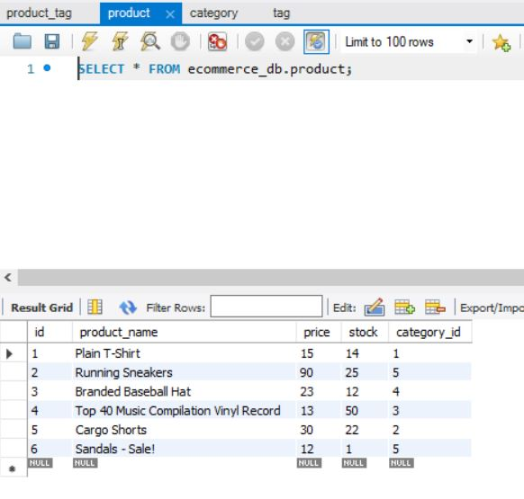
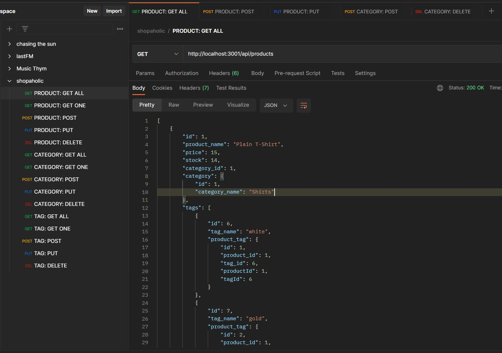

# Shopaholic
Quick and easy inventory manager!

## Table of Contents

- [Description](#description)
- [Deployed Application](#deployed-application)
- [Usage](#usage)
- [Credits](#credits)
- [License](#license)

## Description

With this back-end app, Sequelize and Express allow inventory management for any e-commerce site to be simple and updatable. With the help of Postman and MySQL Workbench, various merchandise can be created, updated, or deleted with associated API routes.

## Deployed Application

This challenge does not include a deployed application. Instead, a screen-recorded video is submitted alongside the github repo link.

Video link: https://drive.google.com/file/d/1AHNXq9GSggx14o8fe0lQl0DnKLrFwNSg/view

## Usage

Below is a screenshot of Shopaholic.

## Credits

List of resources used:

https://expressjs.com/en/guide/routing.html

https://sequelize.org/docs/v6/core-concepts/model-querying-basics/

https://stackoverflow.com/questions/21066755/how-does-sequelize-sync-work-specifically-the-force-option

https://sequelize.org/docs/v6/moved/data-types/

https://sequelize.org/docs/v6/core-concepts/validations-and-constraints/

https://sequelize.org/docs/v6/core-concepts/assocs/

https://www.youtube.com/watch?v=ExTZYpyAn6s&ab_channel=Kritika%26Pranav%7CProgrammerCouple

https://stackoverflow.com/questions/10320786/error-1451-cannot-delete-or-update-a-parent-row-a-foreign-key-constraint-fails#:~:text=This%20means%20that%20you%20cannot,self%2Dreferential%20ON%20DELETE%20CASCADE%20.

## License

No licenses (default copyright laws apply).

---